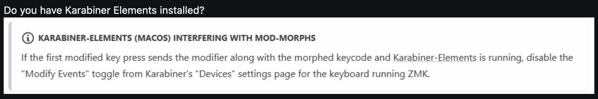
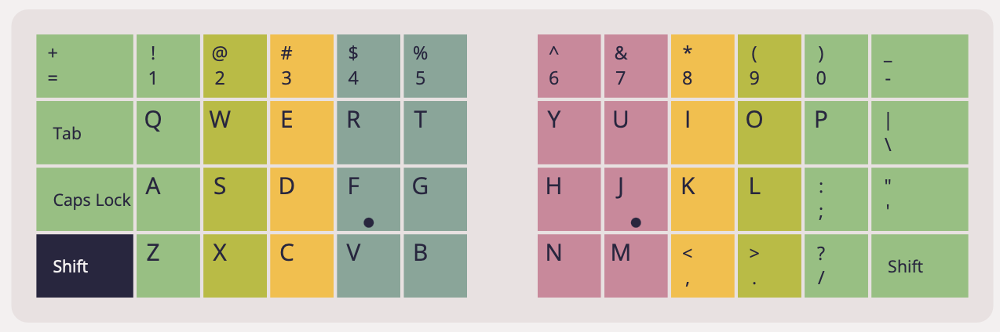
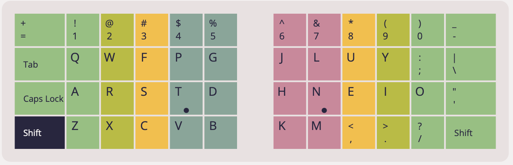
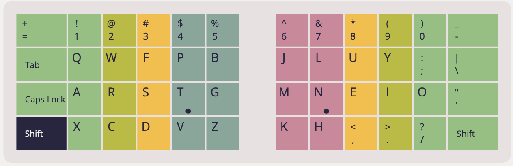
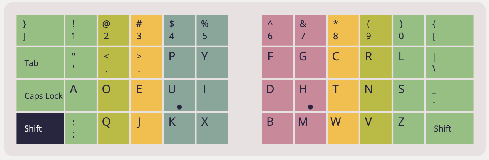
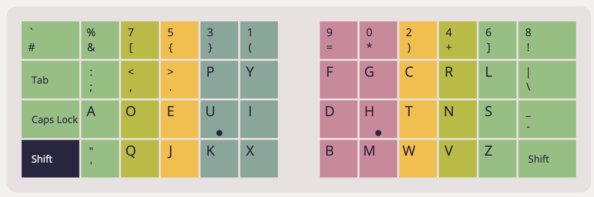
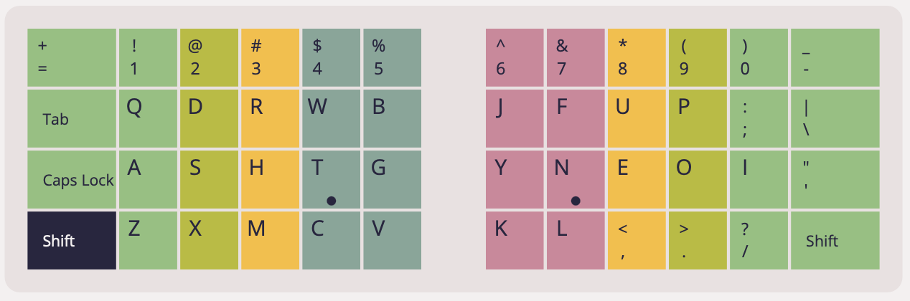

# Kinesis Advantage 360 Pro ZMK Config

## Available Keyboard Layouts

The following keyboard layouts are included:

1. QWERTY (default)
2. [Colemak](https://colemak.com)
3. [Colemak-DH](https://colemakmods.github.io/mod-dh/)
4. Dvorak
5. [Programmer Dvorak (dvp)](https://www.kaufmann.no/roland/dvorak/)
6. [Workman](https://workmanlayout.org)
7. [Workman-P](https://workmanlayout.org)

You can switch between layouts using the MOD layer. Each layout is assigned to a
different layer number and uses distinct LED colors for easy identification.

## Modifying the keymap

[The ZMK documentation](https://zmk.dev/docs) covers both basic and advanced
functionality and has a table of OS compatibility for keycodes. Please note that
the RGB Underglow, Backlight and Power Management sections are not relevant to
the Advantage 360 Pro's custom ZMK fork. For more information see
[this note](#note)

There is a web based GUI available for editing the keymap. It is available at

- https://kinesiscorporation.github.io/Adv360-Pro-GUI
- https://nickcoutsos.github.io/keymap-editor/ (alternative)

This repository is also compatible with certain other web based ZMK keymap
editors however they may have keycodes or behaviours that are not implemented on
the 360 Pro and could cause unusual behaviour or build failures. Furthermore
changes made on other keymap editors may not be compatible if one goes back to
using the Kinesis GUI.

Certain ZMK features (e.g. combos) require knowing the exact key positions in
the matrix. They can be found in both image and text format
[here](assets/key-positions.md)

!!! If behavior is not as expected, be sure there is no conflict with Karabiner
Elements on your machine. 

## Screenshots

QWERTY 

Colemak 

Colemak-DH 

Dvorak 

Programmer Dvorak (dvp) 

Workman + Workman-P (N with changes) 
